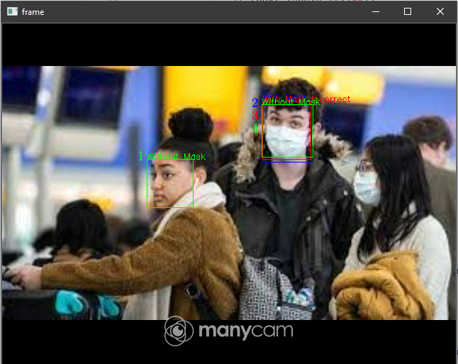

## Pembantu Deteksi Penggunaan Masker yang Baik dan Benar Menggunakan Object Detection Faster R-CNN
Untuk Codig 3.0 Data Mining 
> Peran *data mining* untuk menghadapi kehidupan pada era *new normal*

Disusun oleh Tim Yakuy 2, Universitas Gadjah Mada
- Ardacandra Subiantoro (18/427572/PA/18532)
- Arief Pujo Arianto (18/430253/PA/18766)
- Chrystian (18/430257/PA/18770)
## Abstrak

## Metode
### Implementasi Program
#### Hasil prediksi program.

| i | Label               |  Score |
|:-:|---------------------|:------:|
| 1 | Without Mask        | **0.8836** |
| 2 | With Mask           | **0.8032** |
| 3 | With Mask Incorrect | 0.2569 |
| 4 | Without Mask        | 0.2145 |
#### Hasil prediksi program dengan Post-processing.

Hasil prediksi program dengan non-maximum suppression.
| i | Label               |  Score |
|:-:|---------------------|:------:|
| 1 | Without Mask        | **0.8836** |
| 2 | With Mask           | **0.8032** |

## Hasil

### Hasil Program

[Proper Mask Detection with Faster R-CNN WebCam Demo](https://www.youtube.com/watch?v=dnhFLPc0pXI)
Final Weight (model_with_no_mask.pth) dapat diunduh melalui link [google drive](https://drive.google.com/drive/folders/1foYM6KLFT_eY1_IriE8Wy2UKtfaNRLQh?usp=sharing) 

#### Performa Program
| Program                                     | Waktu Berlalu | Rata-rata Prediksi/s |
|---------------------------------------------|---------------|----------------------|
| WebCam Faster R-CNN                         |     61.96     |         3.15         |
| WebCam Faster R-CNN + Post-processing (nms) |     59.30     |         3.10         |