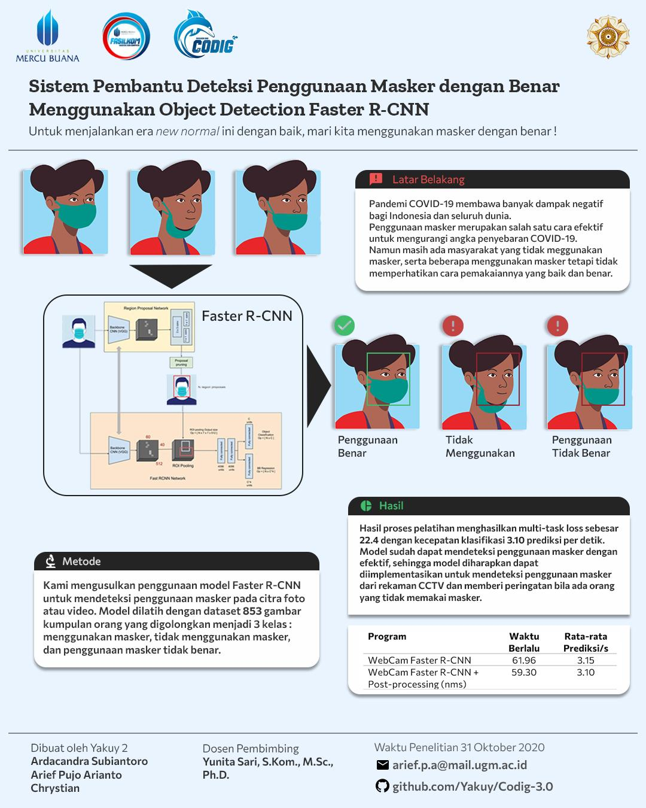

## Proper Use of Mask Detection Using Faster R-CNN
For Codig 3.0 Data Mining with theme
> The role of data mining to face life in the new normal era

Created by Yakuy 2 Team from Universitas Gadjah Mada
- Ardacandra Subiantoro (18/427572/PA/18532)
- Arief Pujo Arianto (18/430253/PA/18766)
- Chrystian (18/430257/PA/18770)
## Abstract
The COVID-19 pandemic has brought many negative impacts for Indonesia and the whole world. The use of masks is an effective way to reduce the spread of COVID-19.We propose the usage of Faster R-CNN model to detect proper wear of masks in photo or video. The model was trained with a dataset of 853 images of groups of people classified into 3 classes: wearing masks, not wearing masks, and using masks incorrectly. The results of the training process resulted in a multi-task loss of 22.4 with a classification speed of 3.10 images per second with GTX 960. The model has been able to detect the correct usage of masks effectively, and we expect it to be used and implemented on CCTV building entry to give a warning if there are people who are not wearing masks or wearing it incorrectly.

## Method
### Program Implementation
#### Program Prediction Output

| i | Label               |  Score |
|:-:|---------------------|:------:|
| 1 | Without Mask        | **0.8836** |
| 2 | With Mask           | **0.8032** |
| 3 | With Mask Incorrect | 0.2569 |
| 4 | Without Mask        | 0.2145 |
#### Program Prediction Output with Post-processing.

Inference results with non-maximum suppression.
| i | Label               |  Score |
|:-:|---------------------|:------:|
| 1 | Without Mask        | **0.8836** |
| 2 | With Mask           | **0.8032** |

## Webcam demo
### Program Results

[Proper Mask Detection with Faster R-CNN WebCam Demo](https://www.youtube.com/watch?v=dnhFLPc0pXI)
 
Final Weight (model_with_no_mask.pt) can be downloaded on [google drive](https://drive.google.com/drive/folders/1foYM6KLFT_eY1_IriE8Wy2UKtfaNRLQh?usp=sharing) 

### Program Performance
| Program                                     | Benchmark Time | average inference/s |
|---------------------------------------------|---------------|----------------------|
| WebCam Faster R-CNN                         |     61.96     |         3.15         |
| WebCam Faster R-CNN + Post-processing (nms) |     59.30     |         3.10         |

Table above shows model performance on GTX 960. We find using simple non-maximum suppression to remove overlapped region did not affect model performance at all.

# Poster

